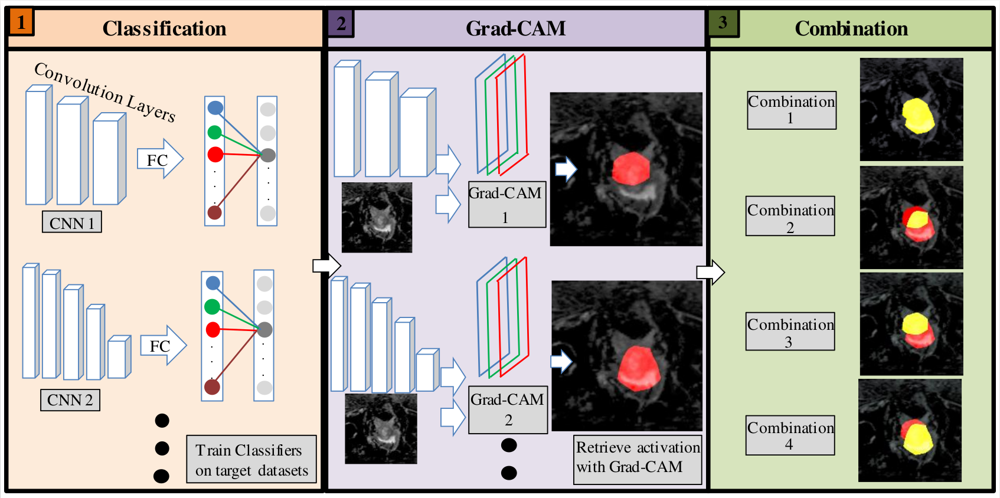
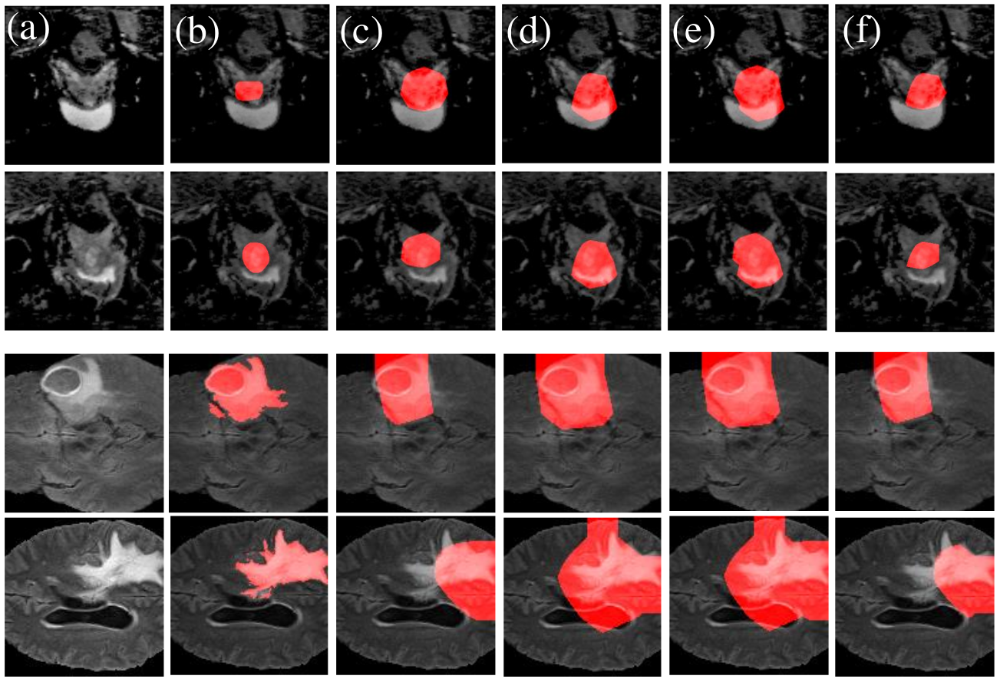

# A Novel Weakly Supervised Semantic Segmentation Ensemble Framework for Medical Imaging


## Abstract
The use of deep learning networks for vision based computer aided diagnostics (CAD) offers a tremendous opportunity for medical practitioners. However, state-of-the-art vision-based CAD systems rely on huge pixel-wise annotated datasets. Such datasets are rarely available, thus severely limiting the applicability of vision-based CAD systems. Hence, semantic segmentation with image labels offers a viable alternative. Semantic segmentation with image labels is well studied in a general context but seldom applied in the medical sector. The major challenge in applying semantic segmentation with image labels in the medical sector is that predicting on medical datasets is more complex than in the general context. Thus, directly applying methods for semantic segmentation with image labels like class activation maps (CAMs) on medical data generates insufficient results. However, state-of-the-art approaches rely on CAMs as a foundation. To address this problem, we propose a framework to extract useful information from particular low-quality segmentation masks. We achieve this by using our observations that the low-quality predictions have very low false negative detections, and multiple low-quality predictions show high variance among each other. We evaluated our framework on the popular multi-modal BRATS and prostate DECATHLON segmentation challenge datasets to demonstrate an improved dice score of up to 8% on BRATS and 6% on DECATHLON datasets compared to the previous state-of-the-art.
## Getting Started

### Minimum requirements

1. Dependencies :

matplotlib 3.5.2
numpy 1.21.5
Pillow 9.2.0
scikit-image 0.19.2
scikit-learn 1.0.2
scipy 1.9.1
torch 1.13.0
torchvision 0.14.0
nibabel 5.0.0


### Download data

#### Dataset

1. The BraTS-2020 dataset can downloaded from this [link](https://www.med.upenn.edu/cbica/brats2020/data.html)
2. The preprocessed and 3-fold cross-validation split of prostate DECATHALON dataset WSS-CMER's link. [link](https://github.com/gaurav104/WSS-CMER).

Basic dataset folder structure, using Prostate dataset as an exemplary. (Note: Make sure to change the dataset directory accordingly inside the config file )


## Run the Framework on Decathlon
Please set all paths as mentioned at the top of every program.

1. Train an image classifiers for generating CAMs
```
python deca_Classifier_res34.py
python deca_Classifier_res50.py

```

2. Generate CAMs
```
python3 GradCAM_RES34.py
python GradCAM_RES350.py

```


3. Evaluate the model with 'AND', 'OR', '>' or '<' combination
```
python deca_eval_AND.py
python deca_eval_OR.py
python deca_eval_bigger.py
python deca_eval_smaller.py


```

## Run the Framework on BraTS
Please set all paths as mentioned at the top of every program.

1. Covert BraTS dataset
```
python brats_transformation.py

```

2. Train an image classifiers for generating CAMs
```
python brats_Classifier_res34.py
python brats_Classifier_res50.py

```


3. Generate CAMs
```
python brats_GradCAM_res34.py
python brats_GradCAM_res50.py
```

4. Evaluate the model with 'AND', 'OR', '>' or '<' combination
```
python brats_eval_AND.py
python brats_eval_OR.py
python brats_eval_bigger.py
python brats_eval_smaller.py

```


## Results
Qualitative segmentation results on BraTS and DECATHLON




