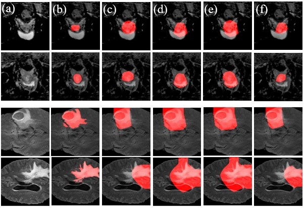

# Automated Ensemble Search Framework for Semantic Segmentation Using Medical Imaging Labels


## Abstract
Reliable classification and detection of certain medical conditions, in images, with state-of-the-art semantic segmentation networks require vast amounts of pixel-wise annotation. However, the public availability of such datasets is minimal. Therefore, semantic segmentation with image-level labels presents a promising alternative to this problem. Nevertheless, very few works have focused on evaluating this technique and its applicability to the medical sector.
Due to their complexity and the small number of training examples in medical datasets, classifier-based weakly supervised networks like class activation maps (CAMs) struggle to extract useful information from them. However, most state-of-the-art approaches rely on them to achieve their improvements. Therefore, we propose a framework that can still utilize the low-quality CAM predictions of complicated datasets to improve the accuracy of our results.
Our framework achieves that by: First, utilizing lower threshold CAMs, so that the target object is covered with high certainty. Second, by combining multiple low threshold CAMs, they even out their errors, while keeping the target object highlighted. We performed exhaustive experiments on the popular multi-modal BRATS and prostate DECATHLON segmentation challenge datasets. Using the proposed framework, we have demonstrated an improved dice score of up to 8% on BRATS and 6% on DECATHLON datasets compared to the previous state-of-the-art.
## Getting Started

### Minimum requirements

1. Dependencies :

matplotlib 3.5.2
numpy 1.21.5
Pillow 9.2.0
scikit-image 0.19.2
scikit-learn 1.0.2
scipy 1.9.1
torch 1.13.0
torchvision 0.14.0
nibabel 5.0.0


### Download data

#### Dataset

1. The BraTS-2020 dataset can downloaded from this [link](https://www.med.upenn.edu/cbica/brats2020/data.html)
2. The preprocessed and 3-fold cross-validation split of prostate DECATHALON dataset WSS-CMER's link. [link](https://github.com/gaurav104/WSS-CMER).

Basic dataset folder structure, using Prostate dataset as an exemplary. (Note: Make sure to change the dataset directory accordingly inside the config file )


## Run the Framework on Decathlon
Please set all paths as mentioned at the top of every program.

1. Train an image classifiers for generating CAMs
```bash
python deca_Classifier_res34.py
python deca_Classifier_res50.py

```

2. Generate CAMs
```bash
python3 GradCAM_RES34.py
python GradCAM_RES350.py

```


3. Evaluate the model with 'AND', 'OR', '>' or '<' combination
```bash
python deca_eval_AND.py
python deca_eval_OR.py
python deca_eval_bigger.py
python deca_eval_smaller.py


```

## Run the Framework on BraTS
Please set all paths as mentioned at the top of every program.

1. Covert BraTS dataset
```bash
python brats_transformation.py

```

2. Train an image classifiers for generating CAMs
```bash
python brats_Classifier_res34.py
python brats_Classifier_res50.py

```


3. Generate CAMs
```bash
python brats_GradCAM_res34.py
python brats_GradCAM_res50.py
```

4. Evaluate the model with 'AND', 'OR', '>' or '<' combination
```bash
python brats_eval_AND.py
python brats_eval_OR.py
python brats_eval_bigger.py
python brats_eval_smaller.py

```


## Results
Qualitative segmentation results on BraTS and DECATHLON




